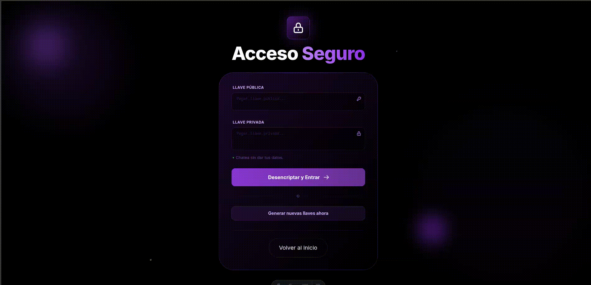
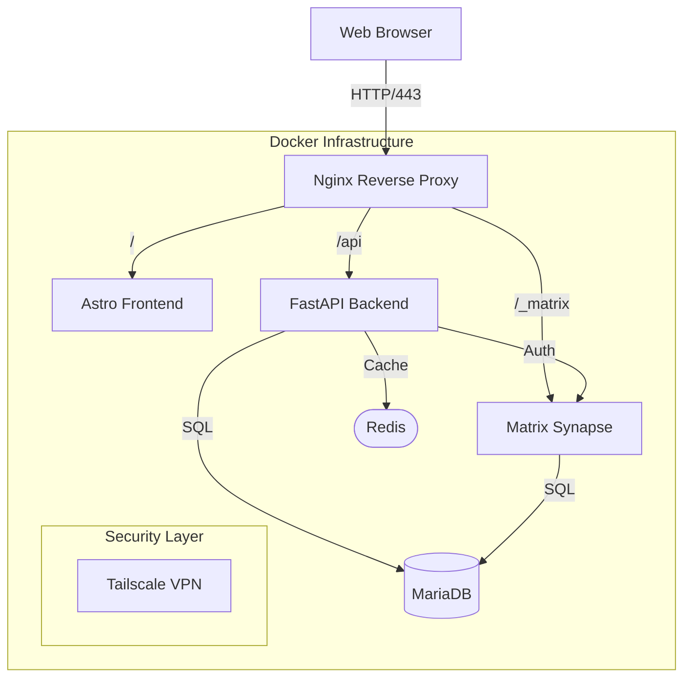

# ChatSender

[](https://github.com/your-repo)
[](https://www.docker.com/)

**ChatSender** is a high-performance, private messaging orchestrator built on **Matrix Synapse**. It provides a secure bridge between a modern **FastAPI** backend and a reactive **Astro** frontend, all secured within a self-hosted infrastructure.

#### Landing Page


#### Chat Page


>[!NOTE] 
The app is fully responsive and can be used on mobile devices the same way as on Desktop.

---

## Architecture

The system follows a microservices architecture orchestrated by Docker, ensuring isolation and scalability.



---

## Key Features

- **End-to-End Privacy**: Fully self-hosted Matrix instance.
- **Challenge-Response Auth**: Ed25519 cryptographic authentication.
- **Modern Stack**: Astro + TailwindCSS for a premium UI experience.
- **Developer First**: Hot-reload enabled for both frontend and backend.
- **Hardened Security**: Pre-configured SELinux support and VPN integration.

---

## Getting Started

### 1. Requirements
Ensure you have the following installed:
- **Docker** >= 24.0
- **Docker Compose** >= 2.20

### 2. Initialization
```bash
# Clone the repository
git clone <chatsender-repository>
cd ChatSender

# Setup environment variables
cat .env.example
# Edit .env with your credentials
```

### 3. Matrix Setup (First Run Only)
```bash
cd synapse
./init-synapse.sh
```
> [!IMPORTANT]
> Configure your `homeserver.yaml` to point to the MariaDB instance as documented in the internal Wiki.

### 4. Deployment

---

##### Start
```bash
# Start development environment
docker compose -f docker-compose.dev.yml up -d --build
```
```bash
# Start production environment
docker compose -f docker-compose.prod.yml up -d --build
```

---

##### Rebuild
```bash
# Rebuild containers
docker compose -f docker-compose.dev.yml build --no-cache
```
>[!IMPORTANT] 
Use this command if changes have not been applied after restarting the containers.

---

##### Stop

```bash
# Stop development environment
docker compose -f docker-compose.dev.yml down

# Stop production environment
docker compose -f docker-compose.prod.yml down
```

---

## Key Management

ChatSender uses Ed25519 key pairs for secure access. Use the included helper script to manage keys:

> [!IMPORTANT]
> Programed: Rotation of private key after a message is sent.
**Private Key**. It is used to sign authentication challenges locally in your browser and is never sent to the server.

---

## Infrastructure Overview

| Service | Port | Description |
| :--- | :--- | :--- |
| **Nginx** | 80 | Entry point & load balancer. |
| **Frontend** | 4321 | Reactive UI (Astro/Tailwind). |
| **Backend** | 8000 | Business logic & Synapse bridge. |
| **Synapse** | 8008 | Core Matrix server. |
| **MariaDB** | 3306 | Persistent storage. |
| **Tailscale/**| P2P | Secure P2P remote access. |

---

## License

The project is open source and available under the AGPL-3.0 License. See the [LICENSE](LICENSE) file for more information. 
